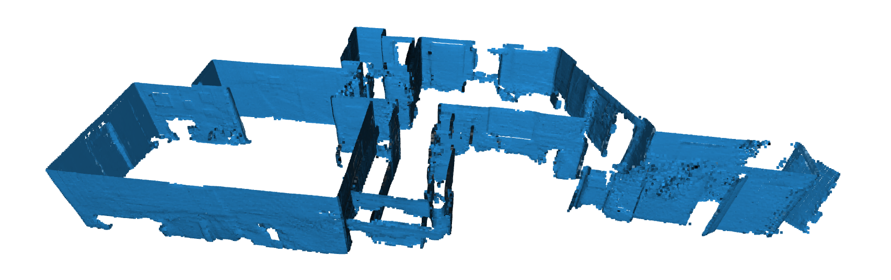

# Final Year Project: Automated 3D-printed map generation

# Getting started
## Option 1: Running in docker
### Requirements
- Docker for [Windows](https://docs.docker.com/desktop/install/windows-install/), [macOS](https://docs.docker.com/desktop/install/mac-install/), or [linux](https://docs.docker.com/engine/install/ubuntu/)
- On linux systems, make sure [Docker Compose](https://docs.docker.com/compose/install/) is installed.

### Run the application
1. `git clone git@github.com:owenbrooks/fyp.git`
2. `cd fyp/docker`
3. `docker-compose up`
4. Go to [http://127.0.0.1:3000](http://127.0.0.1:3000)

## Option 2: Building from source

### Requirements
- Linux (ubuntu/arch)
- Python 3.9 (`yay -S python39`)
- pip (`sudo pacman -S python-pip`)
- virtualenv (`pip install virtualenv`)

### Environment Setup
1. `git clone https://github.com/owenbrooks/fyp.git && cd fyp`
2. `python -m virtualenv --python=/usr/bin/python3.9 venv`
3. `source venv/bin/activate`
4. `pip install -r requirements.txt`

### How to run 

1. Run the flask API: `./api_start.sh`
2. Run the react UI: `./ui_start.sh`

The upload form can be found at [http://127.0.0.1:3000](http://127.0.0.1:3000)

# Credits
Home icon by Putri Apriliza
